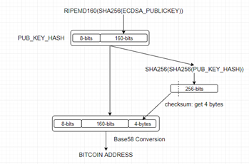

# Sample to Bitcoin Address Generation

This is a sample code for Bitcoin Address Generation. Transactions provide to transfer assets between Bitcoin wallets that keep private
key and bitcoin address. Private key ensure that the transaction comes from the owner of the wallet. Generating bitcoin address as offline
is possible. This code explains how you can generate bitcoin address step by step. As you see at below figure, there are some operations
while bitcoin address is generated.



Let's start to examine how can we generate bitcoin address;
- **Step #1:** Elliptic Curve Digital Signature Algorithm is used for generate Private Key because Public Key Cryptography provides
bitcoin's signature principle.
```
ecdsaPrivateKey = ecdsa.SigningKey.generate(curve=ecdsa.SECP256k1)
print("ECDSA Private Key: ", ecdsaPrivateKey.to_string().hex())
```
- **Step #2:** Due to Public Key Cryptography, we need Public Key that depends on a Private Key. So we generate it with Elliptic Curve
Digital Signature Algorithm too.
```
ecdsaPublicKey = '04' +  ecdsaPrivateKey.get_verifying_key().to_string().hex()
print("ECDSA Public Key: ", ecdsaPublicKey)
```
- **Step #3:** We apply SHA256 to ECDSA Public Key that is created at Step #2.
```
hash256FromECDSAPublicKey = hashlib.sha256(binascii.unhexlify(ecdsaPublicKey)).hexdigest()
print("SHA256(ECDSA Public Key): ", hash256FromECDSAPublicKey)
```
- **Step #4:** We apply RIDEMP160 to value that is created at Step #3 and get value as 20 bytes.
```
ridemp160FromHash256 = hashlib.new('ripemd160', binascii.unhexlify(hash256FromECDSAPublicKey))
print("RIDEMP160(SHA256(ECDSA Public Key)): ", ridemp160FromHash256.hexdigest())
```
- **Step #5:** We prepend 00 as Network Byte to value that is created at Step #4.
```
prependNetworkByte = '00' + ridemp160FromHash256.hexdigest()
print("Prepend Network Byte to RIDEMP160(SHA256(ECDSA Public Key)): ", prependNetworkByte)
```
- **Step #6:** We apply double SHA256 to value that is created at Step #5 to Checksum.
```
hash = prependNetworkByte
for x in range(1,3):
    hash = hashlib.sha256(binascii.unhexlify(hash)).hexdigest()
    print("\t|___>SHA256 #", x, " : ", hash)
```
- **Step #7:** We get 4 bytes of value that is created at Step #6 as Checksum.
```
cheksum = hash[:8]
print("Checksum(first 4 bytes): ", cheksum)
```
- **Step #8:** We append Checksum value that is created at Step #7 to value that is created at Step #5.
```
appendChecksum = prependNetworkByte + cheksum
print("Append Checksum to RIDEMP160(SHA256(ECDSA Public Key)): ", appendChecksum)
```
- **Step #9:** We applied Base58 Encoding to value that is created at Step #8. After Base58 Encoding, we get value that is
Bitcoin Address.(In Python, b58encode result should decode to utf-8 for showing)
```
bitcoinAddress = base58.b58encode(binascii.unhexlify(appendChecksum))
print("Bitcoin Address: ", bitcoinAddress.decode('utf8'))
```

Finally, this result is comprised;
```
ECDSA Private Key:  58d31714300fcf58434422014defce57d53f4cc3b76314d34dee729dcb7fc07e
------------------------------------------------------
ECDSA Public Key:  0478e410b429fcc6b9d46d30526fdb6d1fa292f38ce02bd2c6c569a4d0c06ab7b0bf2c7444f95064b5b4e9ed2ef2eb96425a3e9873315cbeb6a2e3b22e7978d304
------------------------------------------------------
SHA256(ECDSA Public Key):  558f16eb2e93084f763b20a0005734ff32f134ef53990da26273166bb7afc28c
------------------------------------------------------
RIDEMP160(SHA256(ECDSA Public Key)):  daa4e87dcb30d406d24f76bcc2afe2ef550c9068
------------------------------------------------------
Prepend Network Byte to RIDEMP160(SHA256(ECDSA Public Key)):  00daa4e87dcb30d406d24f76bcc2afe2ef550c9068
------------------------------------------------------
	|___>SHA256 # 1  :  1d7d571d176f378eabd73b1e3ac0fb5a688855d41ae5ee8956afb9c13b5c7027
	|___>SHA256 # 2  :  b0a511fb05bcf1872be44d98dad592c9641fe47ee7f48f1ecee18b6805bd4ba4
------------------------------------------------------
Checksum(first 4 bytes):  b0a511fb
------------------------------------------------------
Append Checksum to RIDEMP160(SHA256(ECDSA Public Key)):  00daa4e87dcb30d406d24f76bcc2afe2ef550c9068b0a511fb
------------------------------------------------------
Bitcoin Address:  1Lw5rqh94dWzArQ9tDY6Ucswxo3Ums7VWi
```
